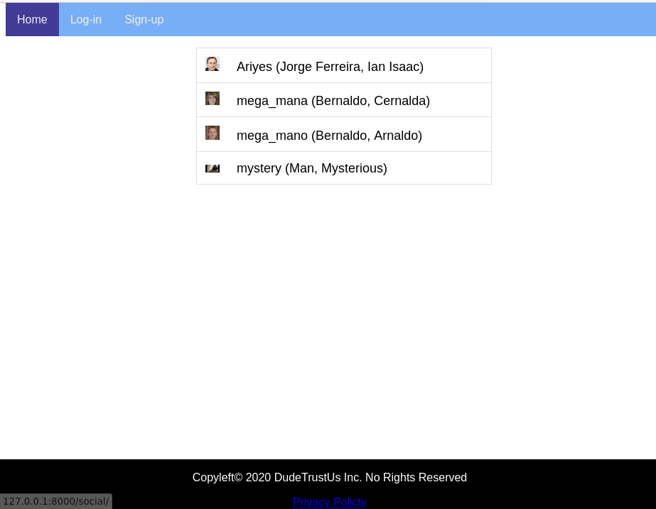
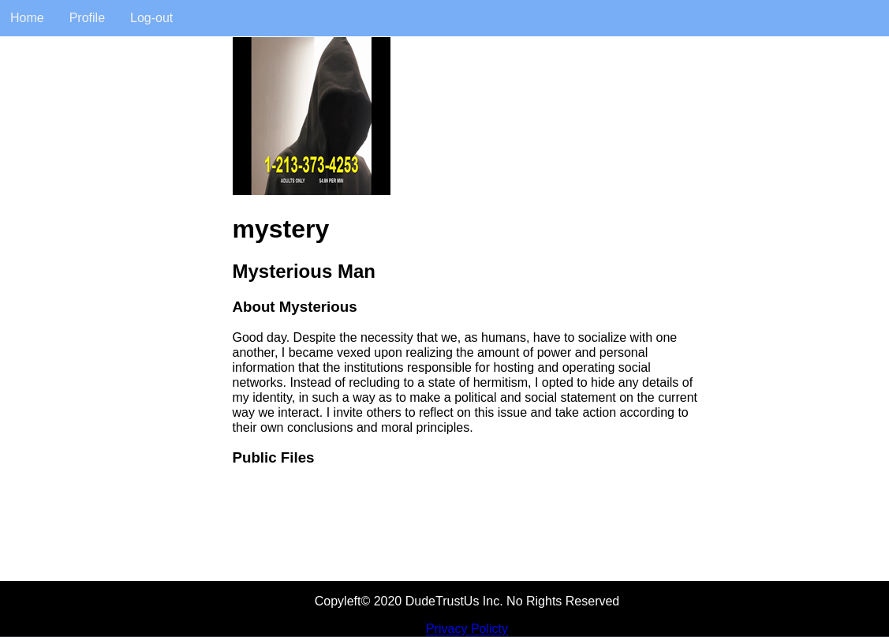
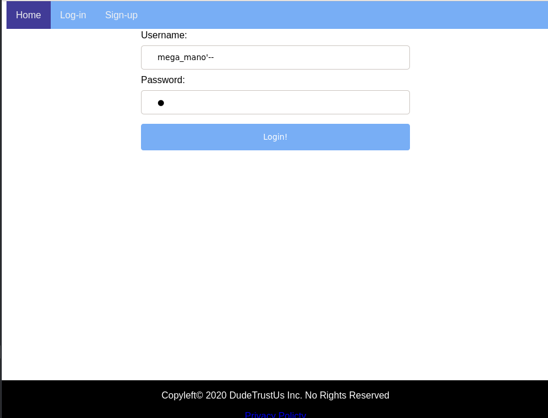
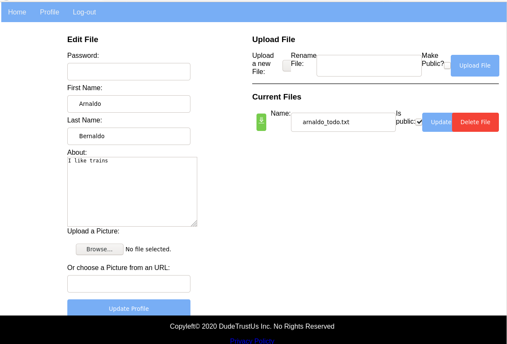
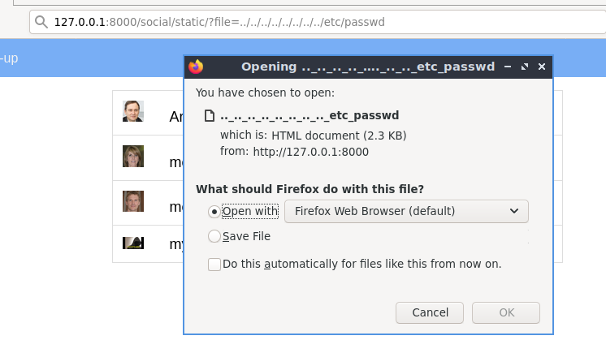

# HeadPage

A Simple and porpousely vulnerable django web-application for testing and learning

## Idea

* Create a social-media-like (HeadPage != Facebook) web application with a relatively small, and vulnerable, code base. 
* Users create public profiles, upload files for public (such as photos)or private (such as pdfs) use and browse other users' profiles.

## Running 
The recommended way is using docker using the following commands to build and run the container

`docker build --tag=headpage:latest .`

`docker run -d --rm -p 8000:8000 --name headpage headpage:latest`

Otherwise, install the dependencies on `requirements.txt` and run the default django webserver and you'll be good to go.

## Allowing connections other than localhost

Change the following line on `src/headpage/settings.py` to serve HeadPage on all interfaces. This can be dangerous, if possible run inside a VM on Host-Only interface.

`ALLOWED_HOSTS = ['*']`

## Why?
**Yes**

## The site is ugly as sin!
**Yes** - Also, I'm not a web developer

## Main Vulnerabilities

### SQL Injection
* Login and Register user forms use raw, unsanitized SQL queries and are subject to injection via trailing comment and `'` to close strings

### XSS
* The user's first/last name or username are not sanitized and are displayed on their profile.
    * E.g. username: ``

### CSRF
* To be Implemented (?)

### Open Redirect
* When clicking the link to the login/register page from a previous page, the previous Page URL is sent as a Parameter for a redirection back to the previous page after loging in/registering. The redirection URL is not validated.
    * E.g. 127.0.0.1:8000/social/login/?redirect=evilsite.url

### Remote Code Execution
* The user can choose a picture already uploaded for his profile, or download an image from a URL. The download is done by invoking `wget` without escaping the user input
    * E.g. On the picture URL field `; touch evil.sh #`
* (based on the django.nV injection vuln) The user can upload a file and give an arbitrary name (or rename already uploaded files). The rename is done with `mv`. This process is vulnerable to code injection in the new file name, or replacing an existing program with a malicious version

### Malicious File Upload
* There is no file checking on user uploaded files, or URL downloads.

### Illegal File Access / Path Traversal
* Some static files are returned after GET requests `127.0.0.1:8000/social/static/?file=privacy.txt` The `file` in the GET is not properly validated/sanitized

